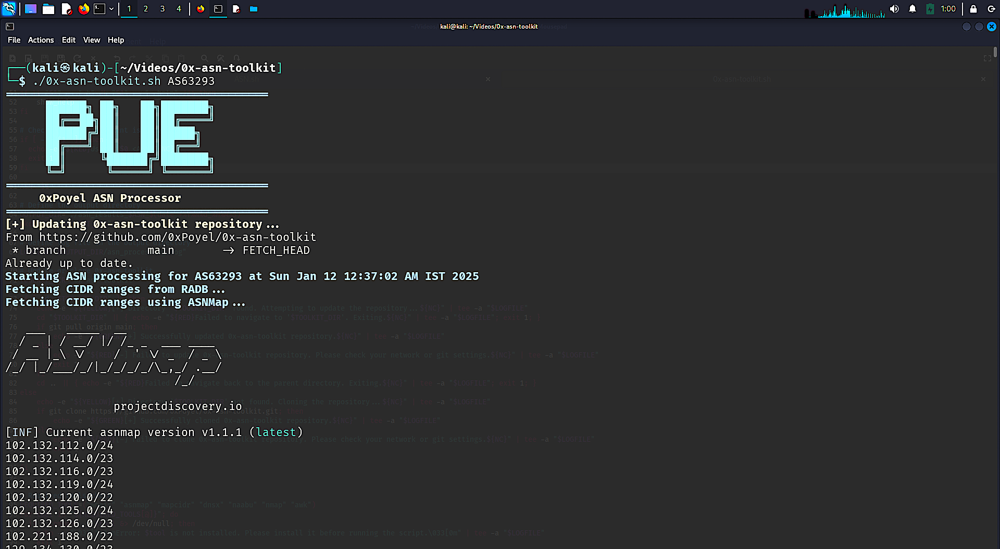
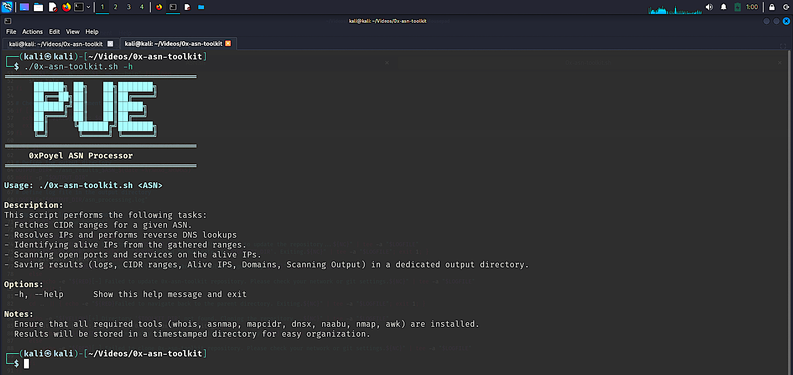
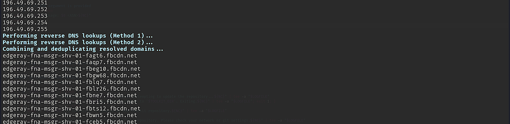

<h1 align="center">「🐦‍🔥」0x ASN Processor</h1>

<p align="center"></p>

## Connect with me

[](https://www.linkedin.com/in/zabed-ullah-poyel/)
[](https://medium.com/@zabedullahpoyel)
[](https://www.youtube.com/@XploitPoy-777)
[](https://x.com/zabedullahpoyel)
[](https://zabedullahpoyel.com)
[](mailto:zabedullahpoyelcontact@gmail.com)

---

## Description

The ASN Processing Tool is a comprehensive script designed for network reconnaissance and service scanning. It allows security researchers and network administrators to fetch CIDR ranges, resolve IPs, perform reverse DNS lookups, and scan for open services for a given ASN (Autonomous System Number).

Whether you're a **bug bounty hunter**, **penetration tester**, or **network security analyst**, this tool streamlines the process of understanding network infrastructure, identifying active IPs, and uncovering potential vulnerabilities. It is an essential resource for conducting reconnaissance, expanding attack surfaces, and performing security assessments.

## Features
- Fetch CIDR ranges associated with an ASN using multiple sources (`whois` and `asnmap`).
- Expand CIDR ranges into individual IPs for detailed analysis `mapcidr`.
- Perform reverse DNS lookups to identify associated domains `dnsx`.
- Identify live IPs with fast port scanning using `naabu`.
- Conduct detailed service scans with `nmap`for open ports and service version detection.
- Automatically combine and deduplicate results.
- Generate detailed log files for tracking progress and results.

---

## Tools Required
The following tools are required to run this script:
1. `whois`
2. `asnmap`
3. `mapcidr`
4. `dnsx`
5. `naabu`
6. `nmap`
7. `awk`

Ensure all tools are installed and properly configured on your system.

---

## Installation Instructions

### Step 1: Clone the Repository
```bash
git clone https://github.com/XploitPoy-777/0x-ASN-Processor.git
cd 0x-ASN-Processor
```
### Step 2: Install Required Tools
The script will check and install missing tools automatically. Below are the manual installation commands for each tool:

Tools Install:
```bash
# Make it executable:
chmod +x install.sh

# Run the script:
./install.sh
```

Tools Install Check: 

```bash
# Make it executable:
chmod +x check.sh

# Run the script:
./check.sh
```

### Usage Instructions
1. Make the script executable:
```bash
  chmod +x 0x-ASN-Processor.sh
```

2. Open Help file:
```bash
  ./0x-ASN-Processor.sh -h
```
<p align="center"></p>

3. Run the script:
```bash
  ./0x-ASN-Processor.sh <ASN>
```
- Replace <ASN> with the target ASN, e.g., AS12345.

The script automatically performs the following steps:

1. Fetches CIDR ranges.
2. Resolves individual IPs and domains.
3. Scans for live IPs and open ports.
4. Performs detailed service detection.

## **YouTube Tutorial**
Watch our comprehensive walkthrough of the ASN Processing Tool on YouTube: 

[](https://www.youtube.com/watch?v=HNRZZiQD3Oo)

---

### Output Files:
- **CIDR.txt**: Combined list of CIDR ranges.
- **All_ip.txt**: List of all expanded IPs.
- **ASN_domain.txt**: Resolved domains from reverse DNS.
- **Alive_ips.txt**: List of live IPs with open ports.
- **nmap-scan-result.txt**: Detailed service scan results.

**Log File**: A timestamped log file is generated to track the script’s progress (e.g., asn_processing_20250111_123456.log).
  
### Example
```bash
./0x-ASN-Processor.sh AS12345
```
### Output:
An example output structure:
- CIDR Ranges:
```bash
192.168.0.0/24
10.0.0.0/8
```
- Expanded IPs:
```bash
192.168.0.1
192.168.0.2
...
```
- Resolved Domains:
```bash
example.com
subdomain.example.com
```

<p align="center"></p>

- Live IPs:
```bash
192.168.0.5
10.0.0.3
```
- Service Scan:
```bash
PORT      STATE SERVICE VERSION
22/tcp    open  ssh     OpenSSH 7.6p1 Ubuntu
80/tcp    open  http    Apache httpd 2.4.29
```
<p align="center"></p>

### Dependencies
Ensure the following are installed:
- Linux/Unix Shell
- Golang: For asnmap, mapcidr, naabu and dnsx
```bash
sudo apt install -y golang
```
## Contribution
- Contributions are welcome! Please feel free to open issues or submit pull requests for improvements.

### ⚠️ Reminder
- Always ensure you have proper authorization before scanning any network or ASN.
- This tool is intended for ethical use in penetration testing and reconnaissance.

🛡️ **Disclaimer**: Unauthorized use of this tool may result in legal consequences. Use responsibly.


